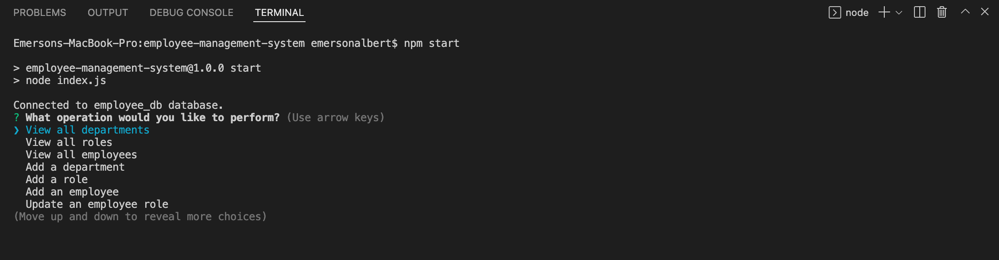

# Employee Management System

This is an employee tracker that uses Node.js, Inquirer, and MySQL to build a command line application that is able to manage employees within a company. 

## How to use

To use this application you first need to open your integrated interminal (Control + \` on mac) and enter `npm start`.
This will then prompt you a question with several options. Choose with operation you would like to perform and answer the prompts that follow. [Click here](https://drive.google.com/file/d/1rIkfKZQvqJIy3bqvyxkca9rtyWJbULaB/view) to view a video demonstation of the application.

Below is what you will see when the application is first deployed.

To view the code behind this assignment feel free to visit the repo on [Github.](https://github.com/E-Albert/employee-management-system)

